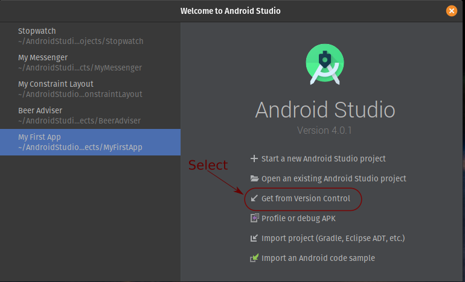
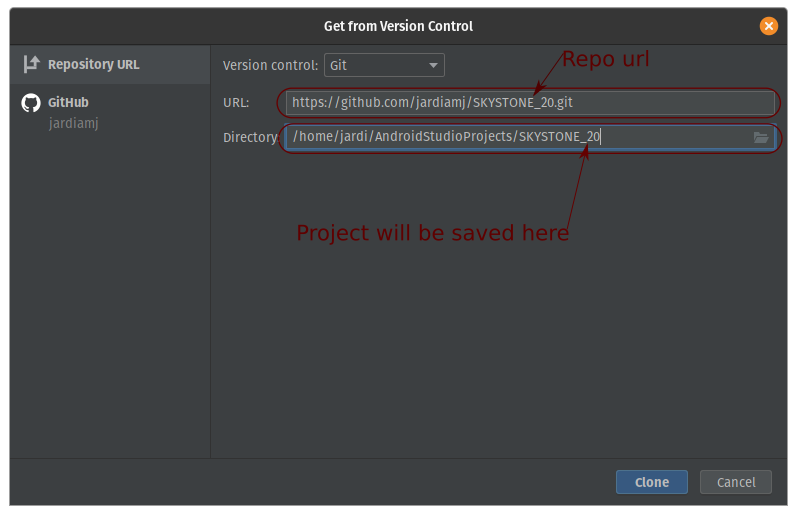
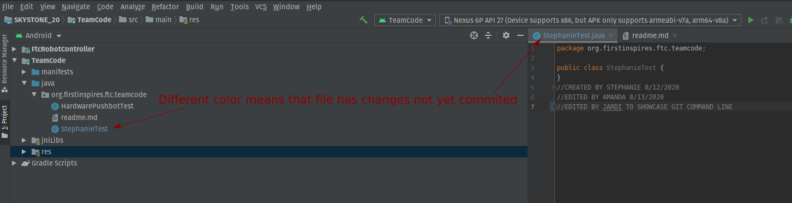
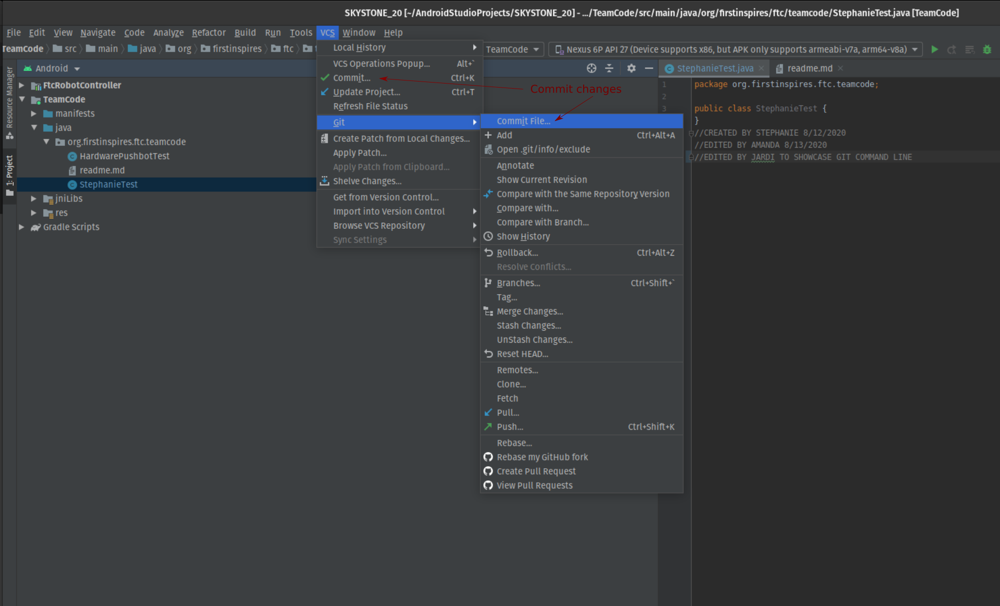
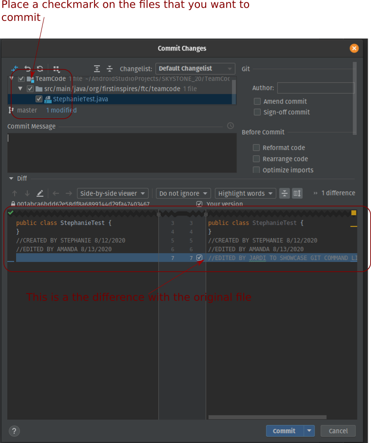
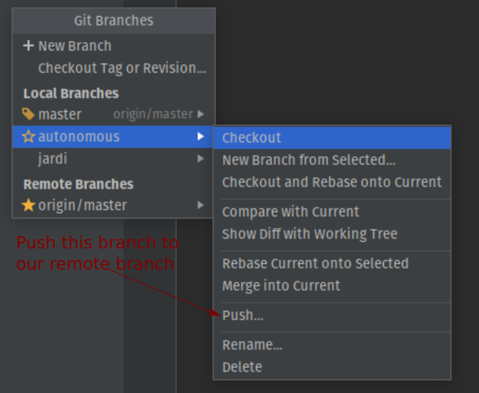
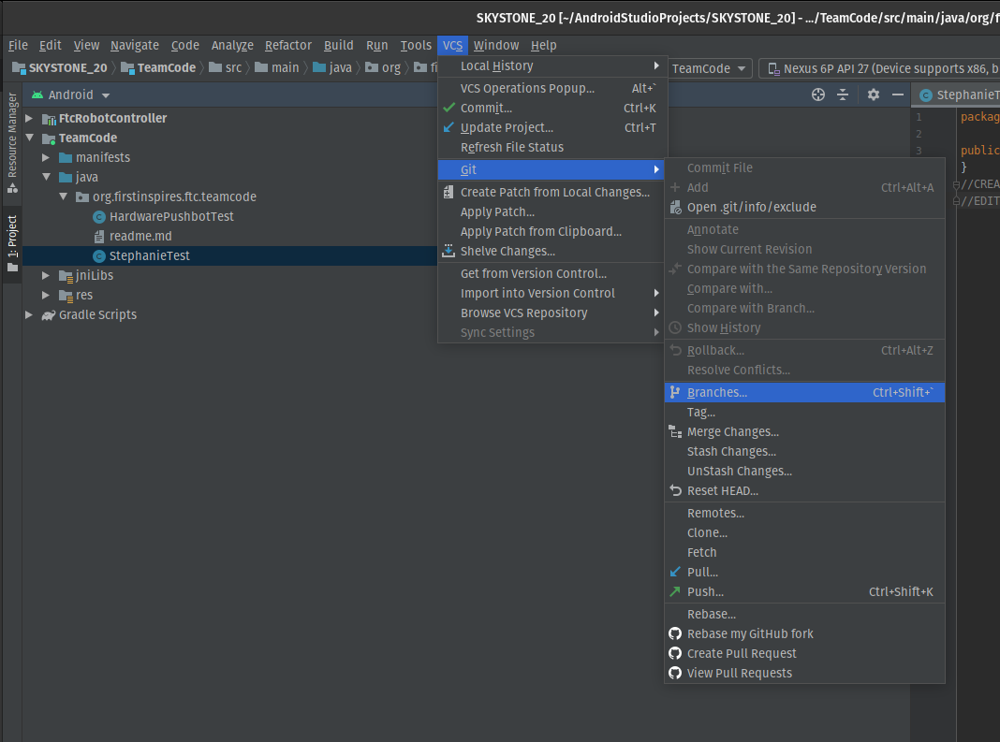
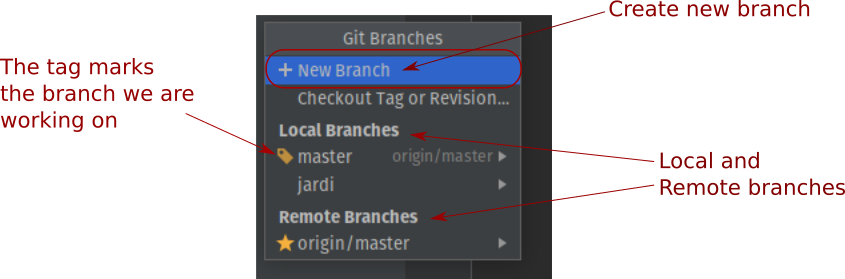
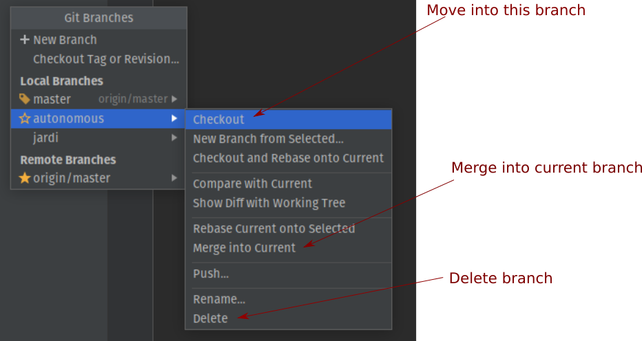

# How to use git on the Command Line
I forked terrifictechbots test repository on Github so I could make changes to it without affecting the main branch (normally called "upstream").
My fork of the test repo lives here: https://github.com/jardiamj/test.git

I will follow each one of the following steps in order.

---

## Getting my repository from Github (cloning)
<details>
<summary>On the Command Line</summary>
<p>

```console
git clone https://github.com/jardiamj/test.git
```

This command will clone the repository into a folder of the same name, in this case "test".
</p>

</details>

<details>
<summary>On Android Studio</summary>




</details>

---

## Checking branch status, commit and push changes into our remote repository
<details>
<summary>On the Command Line</summary>
<p>

The command check the status of our repository is ```git status``` but to understand its output we first need to understand what it means "to commit" a change. For practical purposes let's think of a commit as a snapshot of our project at a particular place in time, with that analogy we can say that git keeps a timeline of commits.

Every time we make a commit we are taking a snapshot of our project, we could later roll back to this state if needed to, therefore its recommended that we only commit when our project is in a working state.

Let's take a look at the output of the ```git status``` command:

```console
On branch master
Your branch is up to date with 'origin/master'.

Changes not staged for commit:
  (use "git add <file>..." to update what will be committed)
  (use "git restore <file>..." to discard changes in working directory)
        modified:   TeamCode/src/main/java/org/firstinspires/ftc/teamcode/StephanieTest.java

no changes added to commit (use "git add" and/or "git commit -a")
```

This is telling us that:
- We are working on the master branch.
- Our branch is up to date with 'origin/master'
- There are changes not staged for commit which means that, if we commit, these changes will not go into the commit (snapshot). Git allows us to do this in case there are changes that we don't want to include in the commit.
- This command also tells us what we can do to add the changes ```git add``` and/or ```git commit -a```. The -a flag means: include all changes included those not staged.

Staging a change means to place it in the list of changes that will be commited and that is what ```git add``` does. Let's stage our changes and then check the satus again:

```command
git add -A
```
```command
git status
On branch master
Your branch is up to date with 'origin/master'.

Changes to be committed:
  (use "git restore --staged <file>..." to unstage)
	modified:   TeamCode/src/main/java/org/firstinspires/ftc/teamcode/StephanieTest.java

```

The -A flag means "add all changes" the the git status tells us that we have changes to be committed, it also tells us how to remove or unstage those changes.

Now we can commit our changes which we do using ```git commit```. If we run the command just like this we will be presented with an editor, usually the default editor in our system, where we have to write a description for our commit. It is recommended that we write a very descriptive message. We could also run it with the ```-m``` flag follow by our message, like in the following example:

```command
git commit -m "Added file git_use.md with instructions on how to use git"
```

We have been working on our local copy so far, it's now time to push those changes into our "origin" branch for which a link was automatically created when we cloned the project. The command to do that is, you guessed it: ```git push``` followed by the name of our remote branch and then the name of the branch we want to push to it. We can ommit the last 2 parameters, in which case git will push the current local branch into the default remote branch:

```command
git push origin master
```
or simply:
```command
git push
```

</p>
</details>

<details>
<summary>On the Android Studio</summary>

Android Studio let's us know that a file has changes not yet commited by chaging the file's name color on the tree view and file tab.



To commit a change go to: VCS --> Commit (for the general project) or VCS --> Git --> Commit File/Directory (for a specific file or directory).



In the commit dialog window you can place a checkmark on the files that you want to add with this commit. It also shows you a side to side difference between the last commit and the current state of the files.



To push a branch into our remote repository we can go to the branch menu and select the push option



</details>

---

## List, create and delete branches
Since we are using branches already let's take a look at what we have in our local copy.
To list all the branches

<details>
<summary>On the Command Line</summary>
<p>

Command for listing all branches:
```console
git branch -a
```

This is the output from the previous command:
```console
  jardi
* master
  remotes/origin/HEAD -> origin/master
  remotes/origin/master
```

This command shows one local branch, automatically named "master", and one remote branch named "origin/master". HEAD is a pointer to origin/master.
The asterisk before "master" indicates that this is the branch we are working on.

To create a new branch yout type the command ```git branch``` followed by the name of the new branch that you want to create. If we want to create a branch called autonomous we type:
```console
git branch autonomous
```

This will create a new branch named "autonomous" but you would still be working on the previous one. To move into this new branch we do:
```console
git checkout autonomous
```

If after this last command we run ```git branch -a``` we'll get the following output:
```console
* autonomous
  jardi
  master
  remotes/origin/HEAD -> origin/master
  remotes/origin/master
```

To merge a branch after we have worked on it and commited out changes we use the command ```git merge``` followed by the name of the branch that you want to merge.
If I want to merge the branch "jardi" into the branch "master", I move to the master branch first using ```git checkout master``` and then I merge my branch with:
```console
git merge jardi
```

To delete a branch you have to possibilities ```git branch -d``` and ```git branch -D```. The command with lowercase "d" deletes only branches that have been fully merged whereas uppercase "D" deletes a branch even if it hasn't been merged.

If we want to delete the "jardi" branch, now that we already merged the changes into our main branch, we do:
```console
git branch -d jardi
```

</p>

</details>

<details>
<summary>On Android Studio</summary>
To bring up the branches menu we select: VCS --> Git --> Branches



In this menu we can add a branch, switch to a specific branch, merge and delete a branch.



Here are our options:


</details>